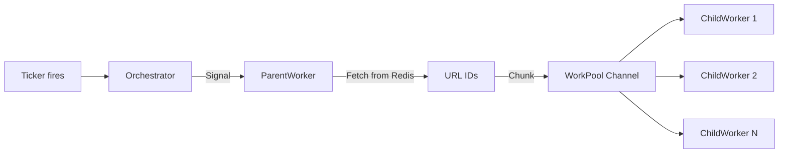
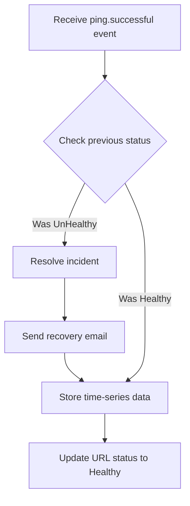
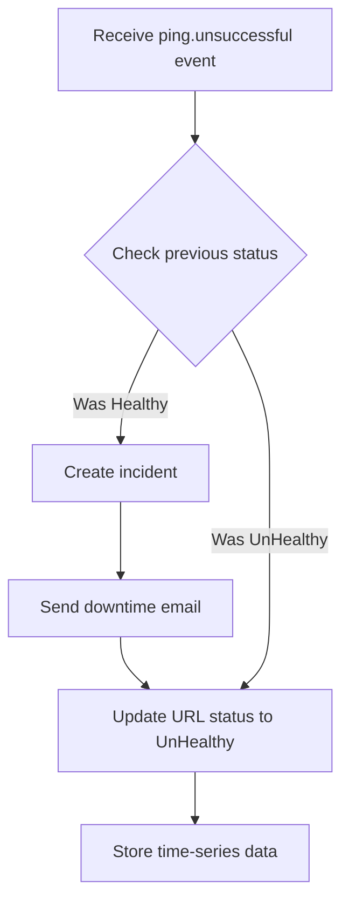

Watchdog uses an event-driven architecture to decouple the monitoring workflow into distinct phases. This page explains the complete data flow from system initialization through HTTP checks to event handling and persistence.

## System initialization

The monitoring service starts with the `guard` command, which initializes all components in the correct order.

### Startup sequence

1. **Database connection**: Establish PostgreSQL/TimescaleDB connection pool
2. **Redis connection**: Connect to Redis for URL caching
3. **Orchestrator creation**: Initialize the orchestrator with connections
4. **Event bus setup**: Create event bus and register listeners
5. **Supervisor activation**: Start the supervisor's batching goroutine
6. **Worker creation**: Create parent workers for each monitoring interval
7. **Redis prefill**: Load URLs from database into Redis for fast access
8. **Start monitoring**: Begin ticking intervals to trigger checks

```go
// From orchestrator/orchestrator.go:34-46
func NewOrchestrator(ctx context.Context, rdC *redis.Client, pool *pgxpool.Pool) *Orchestrator {
    newLogger := logger.New()
    newEventBus := core.NewEventBus(newLogger)
    
    // Register event listeners
    newEventBus.Subscribe("ping.successful", listeners.NewPingSuccessfulListener(ctx, newLogger, pool))
    newEventBus.Subscribe("ping.unsuccessful", listeners.NewPingUnSuccessfulListener(ctx, newLogger, pool))

    // Create supervisor with batching configuration
    newSupervisor := supervisor.NewSupervisor(
        ctx,
        env.FetchInt("SUPERVISOR_POOL_FLUSH_BATCHSIZE", 100),
        time.Duration(env.FetchInt("SUPERVISOR_POOL_FLUSH_TIMEOUT", 5))*time.Second,
        newEventBus,
        pool,
    )
    // ... return orchestrator
}
```

<Note>
  Listeners are registered before workers start, ensuring no events are missed during initialization.
</Note>

## Monitoring cycle

Each monitoring interval runs independently with its own ticker and worker pool.

### Tick signal flow



1. **Ticker fires**: Go's `time.Ticker` fires at the configured interval (e.g., every 300 seconds for `five_minutes`)
2. **Signal sent**: Orchestrator sends `true` to the parent worker's signal channel
3. **URL fetch**: Parent worker fetches all URL IDs from Redis list `urls_interval_{seconds}`
4. **Work chunking**: URLs are divided into chunks based on `MAXIMUM_WORK_POOL_SIZE`
5. **Distribution**: Chunks are pushed to the work pool channel for child workers

```go
// From orchestrator/orchestrator.go:64-79
for interval, parentWorker := range o.intervals {
    ticker := time.NewTicker(time.Duration(interval) * time.Second)
    o.waitGroup.Add(1)
    go func() {
        for {
            select {
            case <-ticker.C:
                parentWorker.Signal <- true  // Send tick signal
            case <-o.ctx.Done():
                ticker.Stop()
                o.waitGroup.Done()
                return
            }
        }
    }()
}
```

## HTTP check execution

Child workers continuously process URL chunks from the work pool.

### Worker processing flow

<Steps>
  <Step title="Receive work chunk">
    Child worker receives a slice of URL IDs from the parent's work pool channel
    
    ```go
    case urlIds, ok := <-cw.ParentWorker.WorkPool:
    ```
  </Step>
  
  <Step title="Fetch URL details">
    Worker fetches the complete URL object from Redis hash storage
    
    ```go
    // From worker/child_worker.go:56-65
    var url database.Url
    val, err := cw.ParentWorker.RedisClient.HGet(
        cw.Ctx, 
        core.FormatRedisHash(cw.ParentWorker.Interval), 
        urlId
    ).Bytes()
    err = url.UnmarshalBinary(val)
    ```
  </Step>
  
  <Step title="Create HTTP request">
    Worker builds an HTTP request with the configured method (GET, POST, etc.)
    
    ```go
    // From worker/child_worker.go:67-71
    request, err := http.NewRequest(url.HttpMethod.ToMethod(), url.Url, nil)
    ```
  </Step>
  
  <Step title="Execute request">
    HTTP client performs the request with configured timeout
    
    ```go
    // From worker/child_worker.go:52-54
    client := &http.Client{
        Timeout: time.Duration(env.FetchInt("HTTP_REQUEST_TIMEOUT", 5)) * time.Second,
    }
    resp, err := client.Do(request)
    ```
  </Step>
  
  <Step title="Evaluate result">
    Worker determines health based on response:
    - **Network error**: Marks as unhealthy
    - **Status 200-299**: Marks as healthy
    - **Other status codes**: Marks as unhealthy
    
    ```go
    // From worker/child_worker.go:86-90
    task := supervisor.Task{
        UrlId:   url.Id,
        Healthy: resp.StatusCode > 199 && resp.StatusCode < 300,
        Url:     url.Url,
    }
    ```
  </Step>
  
  <Step title="Submit to supervisor">
    Worker sends the task to the supervisor's work pool
    
    ```go
    cw.ParentWorker.Supervisor.WorkPool <- task
    ```
  </Step>
</Steps>

<Info>
  Workers operate concurrently, allowing multiple URLs to be checked simultaneously. The number of concurrent checks is controlled by `MAXIMUM_CHILD_WORKERS`.
</Info>

## Supervisor decision logic

The supervisor receives tasks from all workers and applies batching for efficiency.

### Batching mechanism

The supervisor uses a two-trigger batching system:

<Accordion title="Batch size trigger">
  When the buffer reaches `SUPERVISOR_POOL_FLUSH_BATCHSIZE` tasks (default: 100), the supervisor immediately flushes:
  
  ```go
  // From supervisor/supervisor.go:42-47
  case task := <-s.WorkPool:
      buffer = append(buffer, task)
      if len(buffer) >= s.BatchSize {
          s.flush(buffer)
          buffer = buffer[:0]
      }
  ```
  
  This ensures high-throughput processing during peak monitoring periods.
</Accordion>

<Accordion title="Timeout trigger">
  A ticker fires every `SUPERVISOR_POOL_FLUSH_TIMEOUT` seconds (default: 5) to flush incomplete batches:
  
  ```go
  // From supervisor/supervisor.go:48-52
  case <-ticker.C:
      if len(buffer) > 0 {
          s.flush(buffer)
          buffer = buffer[:0]
      }
  ```
  
  This prevents tasks from sitting in the buffer indefinitely during low-traffic periods.
</Accordion>

### Event publishing

When flushing, the supervisor publishes domain events to the event bus:

```go
// From supervisor/supervisor.go:58-75
func (s *Supervisor) flush(buffer []Task) {
    for _, task := range buffer {
        if task.Healthy {
            s.EventBus.Dispatch(&events.PingSuccessful{
                UrlId:   task.UrlId,
                Healthy: task.Healthy,
                Url:     task.Url,
            })
        } else {
            s.EventBus.Dispatch(&events.PingUnSuccessful{
                UrlId:   task.UrlId,
                Healthy: task.Healthy,
                Url:     task.Url,
            })
        }
    }
}
```

## Event handling

The event bus dispatches events to registered listeners asynchronously.

### Event dispatch flow

```go
// From core/event_bus.go:39-46
func (bus *EventBusImpl) Dispatch(event Event) {
    bus.rwMutex.RLock()
    defer bus.rwMutex.RUnlock()
    for _, handler := range bus.handlers[event.Name()] {
        bus.Logger().Info(fmt.Sprintf("Dispatching %s event to listeners", event.Name()))
        go handler.Handle(event)  // Asynchronous execution
    }
}
```

<Note>
  Each listener runs in its own goroutine, allowing parallel processing of side effects without blocking the supervisor.
</Note>

## Successful ping handling

When a URL check succeeds, the `PingSuccessfulListener` handles the event.

### Recovery workflow



The listener follows this sequence:

1. **Fetch URL metadata**: Retrieve current status from the `urls` table
2. **Detect recovery**: Check if `url.Status == enums.UnHealthy`
3. **Resolve incident**: Mark the incident as resolved in the `incidents` table
4. **Send notification**: Email the contact address with recovery details
5. **Persist metrics**: Insert status record into `url_statuses` hypertable
6. **Update status**: Set URL status to `healthy` in the `urls` table

```go
// From events/listeners/ping_successful_listener.go:31-47
if url.Status == enums.UnHealthy {
    incidentRepo := database.NewIncidentRepository(sl.DB)
    err := incidentRepo.Resolve(sl.ctx, url.Id)
    
    err = core.SendEmail(core.SendEmailConfig{
        Recipients:  []string{url.ContactEmail},
        Subject:     "Your Site is now UP",
        Content:     fmt.Sprintf("Your Site `%v` is UP. It went up at %v. Good work", url.Url, time.Now()),
        ContentType: "text/plain",
    })
}
```

<Info>
  Recovery notifications are only sent when transitioning from unhealthy to healthy, preventing spam on already-healthy URLs.
</Info>

## Unsuccessful ping handling

When a URL check fails, the `PingUnSuccessfulListener` handles the event.

### Failure workflow



The listener follows this sequence:

1. **Fetch URL metadata**: Retrieve current status from the `urls` table
2. **Detect failure**: Check if `url.Status == enums.Healthy`
3. **Create incident**: Log a new incident in the `incidents` table
4. **Send notification**: Email the contact address with downtime details
5. **Update status**: Set URL status to `unhealthy` in the `urls` table
6. **Persist metrics**: Insert status record into `url_statuses` hypertable

```go
// From events/listeners/ping_unsuccessful_listener.go:33-49
if url.Status == enums.Healthy {
    incidentRepo := database.NewIncidentRepository(sl.DB)
    err := incidentRepo.Add(sl.ctx, url.Id)
    
    err = core.SendEmail(core.SendEmailConfig{
        Recipients:  []string{url.ContactEmail},
        Subject:     "Your Site is DOWN",
        Content:     fmt.Sprintf("Your Site `%v` is DOWN. It went down at %v\n . Please check it out", url.Url, time.Now()),
        ContentType: "text/plain",
    })
}
```

## Data model

Watchdog uses three main database tables to store monitoring data.

### URLs table (metadata)

**Schema**: `migrations/20251115112101_create_urls_table.sql`

```sql
CREATE TABLE urls (
    id            SERIAL PRIMARY KEY,
    url           TEXT         NOT NULL,
    http_method   VARCHAR(255) NOT NULL,
    status        VARCHAR(255) NOT NULL,
    monitoring_frequency  VARCHAR(255)  NOT NULL,
    contact_email VARCHAR(255) NOT NULL,
    created_at TIMESTAMP DEFAULT CURRENT_TIMESTAMP,
    updated_at TIMESTAMP DEFAULT CURRENT_TIMESTAMP
);
```

**Go model**: `database/url_model.go:9-18`

```go
type Url struct {
    Id                  int
    Url                 string
    HttpMethod          enums.HttpMethod
    Status              enums.SiteHealth
    MonitoringFrequency enums.MonitoringFrequency
    ContactEmail        string
    CreatedAt           time.Time
    UpdatedAt           time.Time
}
```

### URL statuses table (time-series)

**Schema**: `migrations/20251208081023_create_url_status_table.sql`

```sql
CREATE TABLE url_statuses (
    time     TIMESTAMPTZ NOT NULL,
    url_id   BIGINT      NOT NULL REFERENCES urls(id) ON DELETE CASCADE,
    status   BOOLEAN     NOT NULL
);

SELECT create_hypertable('url_statuses', 'time');
```

This is a **TimescaleDB hypertable** optimized for time-series queries. Each record represents a single check:
- `time`: When the check was performed
- `url_id`: Which URL was checked
- `status`: `true` for healthy (2xx), `false` for unhealthy

**Go model**: `database/url_status_model.go:8-12`

```go
type UrlStatus struct {
    UrlId  int
    Status bool
    Time   time.Time
}
```

### Incidents table

Tracks downtime incidents and their resolution:
- Created when a URL transitions from healthy to unhealthy
- Resolved when the URL recovers
- Used for incident reporting and uptime calculations

## Complete flow diagram

Here's the complete flow from tick to notification:

```
┌─────────────┐
│ Orchestrator│
│   Ticker    │
└──────┬──────┘
       │ Every N seconds
       ↓
┌─────────────┐
│ParentWorker │
│             │
│ 1. Fetch    │
│    URL IDs  │
│ 2. Chunk    │
│ 3. Dispatch │
└──────┬──────┘
       │
       ↓
┌─────────────┐
│ChildWorker  │
│   Pool      │
│             │
│ 1. Get URL  │
│ 2. HTTP req │
│ 3. Evaluate │
└──────┬──────┘
       │
       ↓
┌─────────────┐
│ Supervisor  │
│             │
│ 1. Batch    │
│ 2. Decide   │
│ 3. Publish  │
└──────┬──────┘
       │
       ↓
┌─────────────┐
│  Event Bus  │
│             │
│  Dispatch   │
│  to all     │
│  listeners  │
└──────┬──────┘
       │
       ├──────────────┬──────────────┐
       ↓              ↓              ↓
┌───────────┐  ┌───────────┐  ┌───────────┐
│PingSuccess│  │PingUnsucc │  │  Future   │
│ Listener  │  │ Listener  │  │ Listeners │
│           │  │           │  │           │
│1. Detect  │  │1. Detect  │  │           │
│   state   │  │   state   │  │           │
│2. Incident│  │2. Incident│  │           │
│3. Email   │  │3. Email   │  │           │
│4. Persist │  │4. Persist │  │           │
│5. Update  │  │5. Update  │  │           │
└───────────┘  └───────────┘  └───────────┘
```

## Performance considerations

### Concurrency limits

The system provides several configuration options to control concurrency:

- `MAXIMUM_CHILD_WORKERS`: Controls how many workers process URLs concurrently per interval
- `MAXIMUM_WORK_POOL_SIZE`: Limits chunk size to prevent channel overflow
- `SUPERVISOR_POOL_FLUSH_BATCHSIZE`: Batches events for efficient processing

### Redis caching

URLs are cached in Redis to minimize database queries:
- **Lists**: Store URL IDs grouped by interval for quick enumeration
- **Hashes**: Store complete URL objects for worker access
- **Refresh**: Redis is repopulated when URLs are added or removed

This approach allows workers to perform checks without database access, significantly improving throughput.

## Error handling

The system handles errors at multiple levels:

1. **Network errors**: Treated as unhealthy checks, reported to supervisor
2. **Redis errors**: Logged and operation skipped for that cycle
3. **Database errors**: Logged with structured logging, event handling continues
4. **Email errors**: Logged but don't block metric persistence

This ensures that transient failures in one subsystem don't cascade to others.

## Next steps

<CardGroup cols={2}>
  <Card title="Architecture overview" icon="sitemap" href="./overview">
    Review the high-level system design
  </Card>
  <Card title="Component details" icon="cubes" href="./components">
    Explore individual component implementations
  </Card>
</CardGroup>
