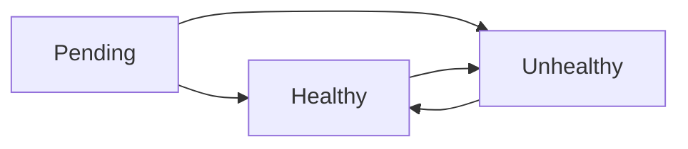

Watchdog allows you to monitor URLs with customizable HTTP methods, monitoring frequencies, and contact emails for notifications. This guide covers everything you need to know about managing your monitored URLs.

## Adding a monitored URL

Use the `add` command to register a new URL for monitoring. The command accepts four positional arguments:

<Steps>
  <Step title="Prepare your URL details">
    Gather the following information:
    - The URL to monitor (required)
    - HTTP method to use (optional, defaults to `get`)
    - Monitoring frequency (optional, defaults to `five_minutes`)
    - Contact email for notifications (required)
  </Step>

  <Step title="Run the add command">
    ```bash
    go run ./cmd/... add <url> <http_method> <frequency> <contact_email>
    ```

    Example:
    ```bash
    go run ./cmd/... add https://example.com get five_minutes owner@example.com
    ```
  </Step>

  <Step title="Verify the URL was added">
    After successful addition, you'll see:
    ```
    URL successfully added, ID: 42
    ```

    The system automatically refreshes the Redis interval list to begin monitoring.
  </Step>
</Steps>

## HTTP methods

Watchdog supports the following HTTP methods for monitoring your URLs:

- `get` - HTTP GET requests (default)
- `post` - HTTP POST requests
- `put` - HTTP PUT requests
- `patch` - HTTP PATCH requests
- `delete` - HTTP DELETE requests

### Examples with different methods

```bash
# Monitor an API endpoint with POST
go run ./cmd/... add https://api.example.com/health post five_minutes api-team@example.com

# Monitor with PUT method
go run ./cmd/... add https://api.example.com/status put one_minute devops@example.com

# Monitor with PATCH
go run ./cmd/... add https://api.example.com/check patch thirty_seconds team@example.com
```

<Note>
The HTTP method parameter is case-insensitive. Both `GET` and `get` are accepted.
</Note>

## Monitoring frequencies

Choose from eight different monitoring intervals based on your needs:

| Frequency | Value | Interval |
|-----------|-------|----------|
| Ten seconds | `ten_seconds` | 10 seconds |
| Thirty seconds | `thirty_seconds` | 30 seconds |
| One minute | `one_minute` | 60 seconds |
| Five minutes | `five_minutes` | 5 minutes (default) |
| Thirty minutes | `thirty_minutes` | 30 minutes |
| One hour | `one_hour` | 1 hour |
| Twelve hours | `twelve_hours` | 12 hours |
| Twenty-four hours | `twenty_four_hours` | 24 hours |

### Choosing the right frequency

<Tip>
**Best practices for frequency selection:**
- Use `ten_seconds` or `thirty_seconds` for critical production APIs
- Use `five_minutes` for standard website monitoring (default)
- Use `thirty_minutes` or `one_hour` for non-critical services
- Use `twelve_hours` or `twenty_four_hours` for batch job endpoints
</Tip>

### Examples with different frequencies

```bash
# Critical API - check every 10 seconds
go run ./cmd/... add https://critical-api.example.com get ten_seconds oncall@example.com

# Standard monitoring - every 5 minutes
go run ./cmd/... add https://example.com get five_minutes admin@example.com

# Daily batch job check - every 24 hours
go run ./cmd/... add https://batch.example.com/status get twenty_four_hours batch-team@example.com
```

## Managing contact emails

Contact emails receive notifications when monitored URLs change status (e.g., from healthy to unhealthy).

### Email notification triggers

Watchdog sends email notifications when:
- A URL becomes unreachable (healthy → unhealthy)
- A URL recovers (unhealthy → healthy)
- State transitions occur based on the supervisor's evaluation logic

<Warning>
Ensure the contact email is valid and monitored. Invalid emails will cause notification failures without affecting the monitoring itself.
</Warning>

### Multiple URLs with the same email

```bash
# Monitor multiple URLs with the same contact
go run ./cmd/... add https://app.example.com get five_minutes team@example.com
go run ./cmd/... add https://api.example.com get five_minutes team@example.com
go run ./cmd/... add https://admin.example.com get five_minutes team@example.com
```

### Different contacts for different services

```bash
# Frontend team
go run ./cmd/... add https://www.example.com get five_minutes frontend@example.com

# Backend team
go run ./cmd/... add https://api.example.com get thirty_seconds backend@example.com

# DevOps team
go run ./cmd/... add https://monitoring.example.com get one_minute devops@example.com
```

## Listing monitored URLs

View all monitored URLs with the `list` command:

```bash
go run ./cmd/... list
```

### Pagination

```bash
# View first page (default: 20 results per page)
go run ./cmd/... list --page=1 --per_page=20

# View second page
go run ./cmd/... list --page=2 --per_page=20

# Show 50 results per page
go run ./cmd/... list --page=1 --per_page=50
```

### Filtering results

Filter by frequency:
```bash
go run ./cmd/... list --frequency=five_minutes
```

Filter by HTTP method:
```bash
go run ./cmd/... list --http_method=get
```

Filter by status:
```bash
# Show only healthy URLs
go run ./cmd/... list --status=healthy

# Show only unhealthy URLs
go run ./cmd/... list --status=unhealthy

# Show pending URLs (newly added)
go run ./cmd/... list --status=pending
```

Combine multiple filters:
```bash
go run ./cmd/... list --frequency=five_minutes --http_method=get --status=healthy
```

### Example output

```
Page 1 (showing 3 results)
→ Next: --page=2
------------------------------------------------------------
1. https://example.com
   ID: 42 | Method: get | Status: healthy | Frequency: five_minutes
   Contact: owner@example.com

2. https://api.example.com
   ID: 43 | Method: post | Status: healthy | Frequency: thirty_seconds
   Contact: api-team@example.com

3. https://batch.example.com
   ID: 44 | Method: get | Status: pending | Frequency: twenty_four_hours
   Contact: batch@example.com

------------------------------------------------------------
More results available. Use --page=2 to continue.
```

## Removing monitored URLs

Remove a URL from monitoring using its ID:

```bash
go run ./cmd/... remove <id>
```

Example:
```bash
# Remove URL with ID 42
go run ./cmd/... remove 42
```

<Steps>
  <Step title="Find the URL ID">
    Use the `list` command to find the ID of the URL you want to remove:
    ```bash
    go run ./cmd/... list
    ```
  </Step>

  <Step title="Remove the URL">
    ```bash
    go run ./cmd/... remove 42
    ```
  </Step>

  <Step title="Verify removal">
    After successful removal, you'll see:
    ```
    URL successfully removing, ID: 42
    ```

    The system automatically refreshes the Redis interval list to stop monitoring.
  </Step>
</Steps>

<Warning>
Removing a URL is permanent and will delete all associated monitoring data. There is no confirmation prompt, so ensure you have the correct ID.
</Warning>

## Using command aliases

Watchdog provides short aliases for common commands:

```bash
# Add command - use 'a' alias
go run ./cmd/... a https://example.com get five_minutes owner@example.com

# List command - use 'ls' alias
go run ./cmd/... ls --status=healthy

# Remove command - use 'rm' alias
go run ./cmd/... rm 42
```

<Note>
The `add` and `analysis` commands both use the `a` alias, which may cause ambiguity. It's recommended to use the full command name `add` to avoid conflicts.
</Note>

## URL status lifecycle

Every monitored URL goes through the following status states:

1. **Pending** - URL is newly added and awaiting first check
2. **Healthy** - URL is responding successfully
3. **Unhealthy** - URL is not responding or returning errors

### Status transitions



The Supervisor component evaluates each check result and determines status transitions. Email notifications are sent to the contact email when transitions occur between healthy and unhealthy states.

## Common patterns

### Monitor all services in a microservices architecture

```bash
# API Gateway
go run ./cmd/... add https://gateway.example.com/health get thirty_seconds devops@example.com

# User Service
go run ./cmd/... add https://users.example.com/health get one_minute backend@example.com

# Order Service
go run ./cmd/... add https://orders.example.com/health get one_minute backend@example.com

# Payment Service (critical)
go run ./cmd/... add https://payments.example.com/health get ten_seconds payments@example.com
```

### Monitor different environments

```bash
# Production
go run ./cmd/... add https://prod.example.com get one_minute prod-alerts@example.com

# Staging
go run ./cmd/... add https://staging.example.com get five_minutes staging-team@example.com

# Development
go run ./cmd/... add https://dev.example.com get thirty_minutes dev-team@example.com
```

### Monitor scheduled tasks

```bash
# Daily backup job (runs at midnight)
go run ./cmd/... add https://backup.example.com/status get one_hour ops@example.com

# Weekly report generation
go run ./cmd/... add https://reports.example.com/status get twelve_hours reports@example.com
```